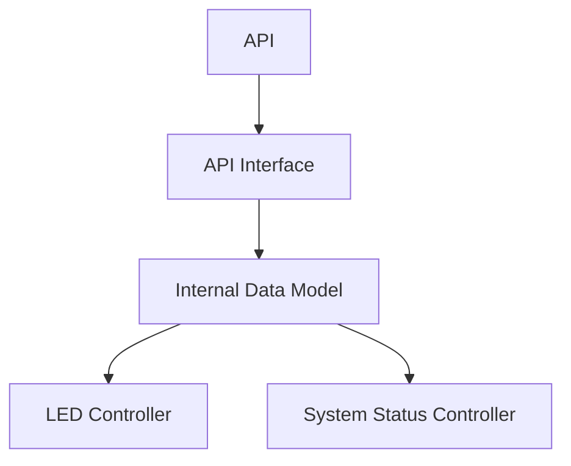

# System Architecture

This document illustrates a high-level overview of the design architecture used by the Ukraine Air Raid Alert Map.

---

### Explanation

#### API 

The API represents the external system that provides live air raid information for Ukraine. The system periodically retrieves data from this source to obtain the latest alert status for each oblast.

#### API Interface

The API Interface is responsible for communicating with the external API.

Responsibilities include:
- sending API requests.
- Receiving API responses.
- Validating received data.
- Converting raw data into a format usable by the internal data model.
- Handling communication errors.
  
The remainder of the system should not depend directly on the external API structure.

#### Internal Data Model

The Internal Data Model stores the processed alert status data for each oblast.

Responsibilities include:
- Maintaining latest system state.
- Providing a consistent and accurate representation of alert data. 
- Storing status data for essential system operations (WiFi, BlueTooth, etc).
  
The Internal Data Model acts as the central data source for alert information within the system.

#### LED Controller  

The LED Controller is responsible for presenting alert status data to the user.

Responsibilities include:
- Reading alert data from the data model.
- Determining the correct LEDs to update.
- Managing visual indicators for other system statuses (such as WiFi connection).

The LED Controller should not communicate directly with the external API and only read data from the Internal Data Model.

#### System Status Controller  

The System Status Controller is responsible for presenting the status of other essential system operations to the user.

Responsibilities include:
- Indicating WiFi connection status.
- Indicating API connection status.
- Indicating BlueTooth status.
- Resolving issues related to these system operations if they occur.
  
The System Status Controller should only detect issues flagged in the Internal Data Model.